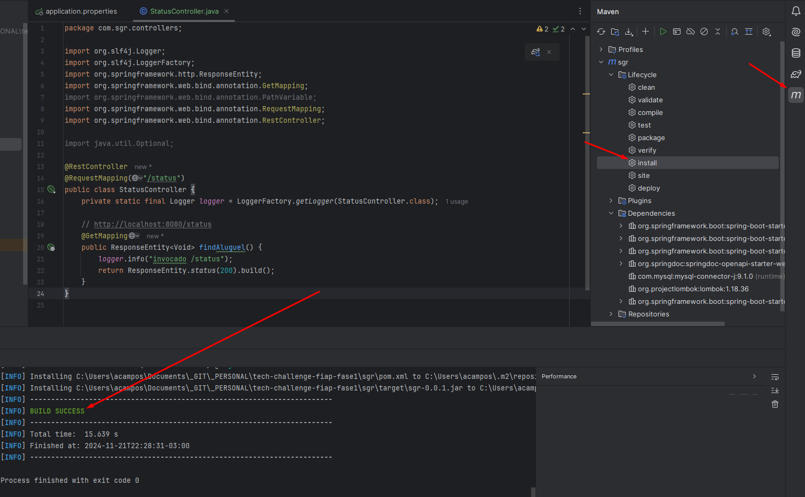
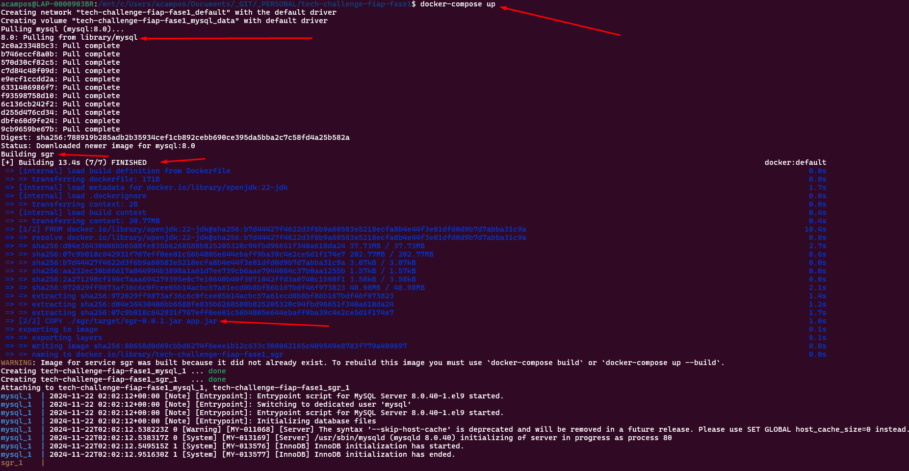
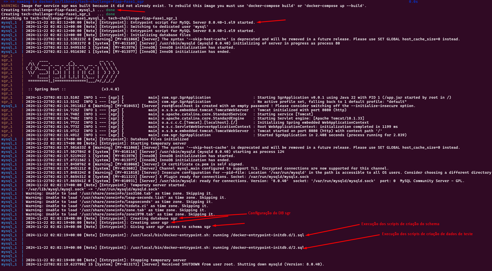
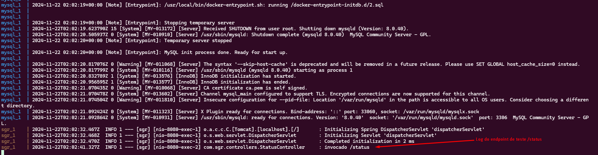
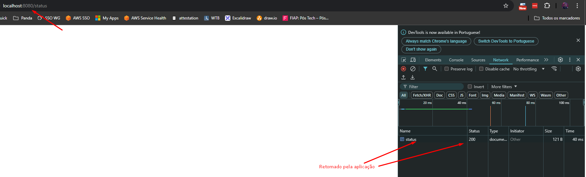

# 🍽️ GastroHub


> 🎓 Projeto desenvolvido como parte do curso de Pós-Graduação em Arquitetura e Desenvolvimento Java da FIAP.

Sistema de gestão de operações para restaurantes com funcionalidades para clientes, incluindo consultas de informações, avaliações e pedidos online.

## 📋 Sumário

- [Sobre o Projeto](#-sobre-o-projeto)
- [Tecnologias](#-tecnologias)
- [Funcionalidades](#-funcionalidades)
- [Começando](#-começando)
- [Documentação da API](#-documentação-da-api)
- [Contribuição](#-contribuição)
- [Licença](#-licença)
- [Contato](#-contato)

## 🚀 Sobre o Projeto

GastroHub é uma solução completa desenvolvida durante o curso de Pós-Graduação em Arquitetura e Desenvolvimento Java da FIAP. O projeto demonstra a aplicação prática de padrões de arquitetura, boas práticas de desenvolvimento e tecnologias modernas do ecossistema Java.

### 🎯 Objetivo Acadêmico

Este projeto serve como aplicação prática dos conceitos aprendidos durante o curso, incluindo:
- Arquitetura de Microsserviços
- Design Patterns
- Clean Code
- DevOps e Containerização
- APIs RESTful

## 🛠️ Tecnologias

- 
- 
- 
- 
- 

## ✨ Funcionalidades

### Para Restaurantes 🏪
- Gestão de cardápio
- Controle de pedidos
- Gestão de reservas
- Relatórios e análises

### Para Clientes 👥
- Consulta de cardápios
- Realização de pedidos online
- Sistema de avaliações
- Reserva de mesas

## 🏃‍♂️ Começando

### Pré-requisitos 📋

- Java Development Kit (JDK) 21
- Docker e Docker Compose
- Maven
- IDE de sua preferência (recomendamos IntelliJ IDEA ou Eclipse)

### 1️⃣ Clone o Repositório

```bash
git clone https://github.com/seu-usuario/gastrohub.git
cd gastrohub
```

### 2️⃣ Compilando a aplicação
Neste momento, a aplicação precisa ser compilada antes de poder ser executada em seus containers Docker.

Para isso, abra o projeto da pasta `sgr` em uma IDE Java e rode a rotina de `install` do maven. No Intellij:


Pelo console execute o comando `mvn clean install`.

Isso irá compilar a aplicação e criar o arquivo `sgr/target/sgr-0.0.1.jar` necessario para build do container da aplicação.
\
&nbsp;
\
&nbsp;

#### Comandos para rodar a aplicação
Para iniciar todos os containers e acessar a aplicação: `docker-compose up`.
Por default o arquivo docker-compose.yaml será utilizado. Que faz:

1. Baixa o container padrão do MySQL.
    1. Configura o DB MySQL (usuarios, senhas, etc.).
    1. Cria o banco de dados 'sgr' (tabelas, etc.).
    1. Cria dados de teste na tabela 'usuarios'.
1. Constroi o container da aplicação.
    1. Baixa o container padrao openjdk.
    1. Copia o arquivo da aplicação para dentro do container.
    1. Cria um entrypoint com o comando de execução da aplicação.
\
&nbsp;
\
&nbsp;

#### Exemplos:
Execução do comando de inicialização:


Criação e configuração do DB:


Teste da aplicação:


\
&nbsp;
\
&nbsp;

#### Comandos para parar a aplicação
Normalmente todos os containers provisionados são encerrados sem problemas com execução do comando `docker-compose down` no diretório em que o arquivo `docker-compose.yaml` está. 

Existem situações em que os containers podem ficar rodando devido a problemas de execução ou falhas de inicialização.

###### Comandos de cleanup
Em caso de problemas para provisionar os containers, execute os comandos abaixo:

- `docker-compose down -v`: Remove os serviços do Docker Compose junto com seus volumes.
    - `down`: Parar e remover contêineres, redes e imagens criados pelo arquivo docker-compose.yml.
    - `-v`: Remove também os volumes associados aos serviços.
- `docker system prune -af`: Remove todos os recursos não utilizados (contêineres, imagens, redes e volumes).
    - `system prune`: Limpa todos os recursos não utilizados (contêineres, redes, imagens, e volumes).
    - `-a`: Remove todas as imagens não utilizadas, não apenas as "dangling" (aquelas sem tags ou sem contêineres associados).
    - `-f`: Força a execução do comando sem solicitar confirmação.
- `docker volume prune -f`: Remove somente volumes órfãos (não utilizados por nenhum contêiner).
    - `volume prune`: Exclui volumes que não estão atualmente em uso.
    - `-f`: Força a execução do comando sem pedir confirmação.
\
&nbsp;
\
&nbsp;

### 3️⃣ Configuração do Docker

Para iniciar o ambiente de desenvolvimento:

```bash
# Parar containers em execução (se necessário)
docker-compose down

# Remover volumes antigos (se necessário)
docker-compose down -v

# Construir e iniciar os containers
docker-compose up --build -d

# Verificar logs
docker-compose logs -f

# Verificar status dos containers
docker ps
```

### 4️⃣ Configuração do Banco de Dados

O Docker Compose irá:
- Inicializar o MySQL na porta 3306
- Criar o banco de dados automaticamente
- Executar os scripts de inicialização do diretório `sql_scripts`

Para acessar o MySQL via terminal:
```bash
docker exec -it gastrohub-mysql mysql -uroot -proot
```

### 4️⃣ Executando o Projeto

1. Navegue até a pasta do projeto Java:
```bash
cd gastrohub
```

2. Execute o projeto usando Maven:
```bash
./mvnw spring-boot:run
```

O aplicativo estará disponível em `http://localhost:8080`

## 📚 Documentação da API

A documentação da API está disponível através do Swagger UI:
```
http://localhost:8080/swagger-ui/index.html
```

## 🔍 Estrutura do Projeto

```
gastrohub/
├── 📂 docker/
│   ├── 📄 docker-compose.yml
│   └── 📄 Dockerfile
├── 📂 sql_scripts/
│   ├── 📄 01-schema.sql
│   └── 📄 02-testdata.sql
└── 📂 gastrohub/
    ├── 📂 src/
    │   ├── 📂 main/
    │   └── 📂 test/
    └── 📄 pom.xml
```

## 🤝 Contribuição

1. Faça um Fork do projeto
2. Crie sua Feature Branch (`git checkout -b feature/AmazingFeature`)
3. Commit suas mudanças (`git commit -m 'Add some AmazingFeature'`)
4. Push para a Branch (`git push origin feature/AmazingFeature`)
5. Abra um Pull Request

